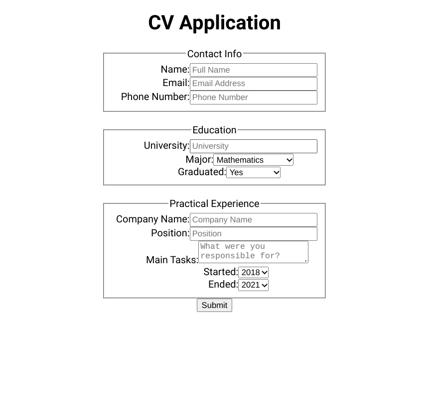

# CV Application

[Odin Project](https://web.archive.org/web/20210124014840/https://theodinproject.com/courses/javascript/lessons/cv-application)

## Table of contents

- [Overview](#overview)
  - [Screenshot](#screenshot)
- [My process](#my-process)
  - [Built with](#built-with)
  - [Requirements](#requirements)
  - [What I learned](#what-i-learned)

## Overview

[Live Link](https://jdegand.github.io/cv-application/)

### Screenshot

## My process

### Built with

- React
- React Class Components

### Requirements 

- [x] Create a new project using npx create-react-app cv-project. 
- [x] Remove the boilerplate code created by create-react-app.
Your application should include:
- [x] A section to add general information like name, email, phone number.
- [x] A section to add your educational experience (school name, title of study, date of study)
- [x] A section to add practical experience (company name, position title, main tasks of your jobs, date from and until when you worked for that company)
- [x]  The submit button should submit your form and display the value of your input fields in HTML elements. 
- [ ] The edit button should add back (display) the input fields, with the previously displayed information as values. In those input fields, you should be able to edit and resubmit the content. 
- [x] Create a components folder in your src directory and add your components.
- [ ] Include a styles folder in your src directory for your CSS files. You’ll need to import these in the component files to use them.

### What I learned

- I should have better documented my code at the start.  I was doing these challenges as quick as possible and neglected to add better readmes.

- Really simple form implementation.  

- The content after submit is editable before you wouldn't know it useless you clicked on some of the returned text.  
- I did that instead of implementing edit button.  

- Didn't require all fields or add validation.  

- Didn't really style this or think much about performance.  

- Could have of broken up form into 3 forms and used a state manager.  
